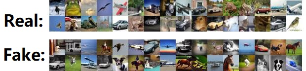

# AI-Generated Synthetic Images Differentiation
### Efe Eboreime, Steve Hudgson, Weixiao Liao and Minh Nguyen

#### Overview

This project addresses the critical challenge of dis-
cerning authentic images from AI-generated ones, crucial in le-
gal, societal, and cybersecurity contexts. Utilizing the CIFAKE
dataset, a custom Convolutional Neural Network (CNN) and
ResNet-50 model are implemented and rigorously compared.
Both models showcase robust capabilities, with ResNet-50
achieving marginally superior accuracy. Precision, recall, and
F1 score metrics offer nuanced insights, emphasizing the signif-
icance of specific error types in model evaluation. The findings
underscore the potential of these models in navigating the
intricate landscape of AI-generated imagery, with implications
for bolstering cybersecurity and ensuring data trustworthiness.
Future research avenues include exploring the integration of
Generative Adversarial Networks (GANs) alongside the exist-
ing CNN architecture for potential performance enhancements

#### Methodology

- Dataset: CIFAKE
- Methods
  - Customs CNN
  - ResNet-50
- Testing and Evaluation based on these metrics: Precision, Recall and F1-Score

#### Usage

The code can be run directly from the `cifake_cnn_v2.ipynb` notebook.

#### References

- Krizhevsky, A., & Hinton, G. (2009). Learning multiple layers of features from tiny images.

- Bird, J.J., Lotfi, A. (2023). CIFAKE: Image Classification and Explainable Identification of AI-Generated Synthetic Images. arXiv preprint arXiv:2303.14126.

